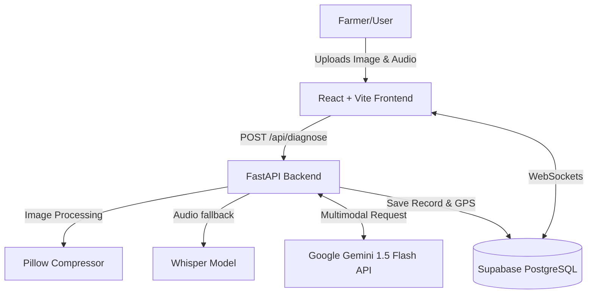

# Animend AI

**AI-Powered Livestock Disease Detection for the Developing World**

## Problem

84% of all veterinary deep learning research focuses exclusively on dogs and cats, leaving a critical blind spot for the livestock that over 1.3 billion people globally depend on for their food security and income. Livestock diseases cause over $300 billion in annual losses in developing nations. For farmers in countries like Nepal, Bangladesh, and across sub-Saharan Africa, the nearest veterinarian is often over 50 kilometers away. By the time help arrives, an animal may die—costing a family months of income. Furthermore, rural farming zones are common origin points for unmonitored zoonotic diseases (diseases that jump from animals to humans).

## Our Approach

Animend AI is a mobile-responsive web application designed to give rural farmers immediate diagnostic power with zero technical training. By simply photographing a sick animal and describing the symptoms in their native language via voice or text, the farmer receives an AI-powered preliminary diagnosis in under 30 seconds. 

Our innovation bridges the gap between sophisticated AI and rural accessibility:
- **Multimodal AI**: Analyzes both images and voice-transcribed symptoms simultaneously to maximize accuracy.
- **Real-time Surveillance**: Every diagnosis is geolocated and plotted on a live disease outbreak map, creating a real-time zoonotic surveillance layer for public health that currently does not exist.
- **Multilingual & Accessible**: Native support for rural languages (Nepali, Hindi, English) and a UI built around voice and visual cues to accommodate low-literacy users.

## Features

### Frontend Features
- **Mobile-First Progressive UI**: Built for seamless operation on 3G connections and any smartphone browser (no app store download required).
- **Multi-Language Voice Input**: Utilizes the Web Speech API to capture symptom descriptions natively in Nepali, English, and Hindi.
- **Live Outbreak Mapping**: Real-time interactive maps via Leaflet.js rendering localized disease clusters and alerting farmers of nearby outbreaks.
- **Intuitive Camera Capture**: Browser-native camera API integration for capturing or uploading livestock photos on the fly.

### Backend Features
- **Asynchronous Processing Engine**: High-performance FastAPI backend to handle concurrent multimodal analysis without blocking.
- **Real-Time Outbreak Detection Logic**: Spatial algorithms that monitor incoming cases and flag an outbreak if 3+ identical diseases appear within a 50km radius in 48 hours.
- **Automated Image Optimization**: On-the-fly resizing and compression of user-uploaded images via Pillow to drastically reduce AI token consumption and bandwidth overhead.
- **Cloud Real-time Synchronization**: WebSockets-powered integration via Supabase to instantly push map pins across all connected active sessions.

### AI/ML Features
- **Zero-Shot Disease Diagnosis**: Integrated with Google Gemini 1.5 Flash API to parse multimodal inputs and return structured JSON (disease, severity, treatments).
- **Fallback Voice Transcription**: Support for offline server-side voice transcription via OpenAI Whisper.
- **Actionable AI Risk Scoring**: Computes confidence intervals, urgency metrics (Low to Critical), and zoonotic risk evaluation (Danger to Humans).

## Architecture

Our application relies on a modern, robust, and zero-cost stack optimized for hackathon deployment and scale.

- **Frontend**: React 19, Vite, Tailwind CSS, React-Leaflet
- **Backend**: Python 3.11, FastAPI, Uvicorn
- **Database**: Supabase (PostgreSQL 15), Supabase Storage for images, Supabase Realtime for WebSockets
- **AI/ML**: Google Gemini 1.5 Flash API, OpenAI Whisper
- **Deployment**: Vercel (Frontend), Railway.app (Backend)



## Data Sources

Data flows securely through our distributed system:
- **User Generated**: GPS coordinates from browser APIs, raw images from camera inputs, and spoken symptoms.
- **AI Model Provider**: Google Gemini acts as the core knowledge engine, grounded by our custom disease prompt structure.
- **Mapping Provider**: OpenStreetMap supplies the base map layer for Leaflet.js.
- **Cloud Database**: Supabase stores real-time case data, bounding boxes, severity scores, and handles geolocated queries.

## Limitations

- **AI Diagnostic Inaccuracies**: The AI is designed to provide *preliminary* diagnoses and actionable triage, but it does not replace a trained veterinarian. False positives or hallucinations may still occur.
- **Scalability constraints**: Relying on free-tier services (Vercel, Railway, Supabase) limits processing capacity. Gemini API free-tier caps at 15 requests per minute.
- **Connectivity Requirements**: The MVP currently requires an active internet connection, which limits utility in absolute dead zones.
- **Geographic Precision**: Location accuracy is constrained to the browser's Geolocation API, which can be approximate in deep rural areas lacking GPS lock.

## Setup Instructions

### Frontend Setup

```bash
cd frontend
# Install dependencies
npm install
# Run development server
npm run dev
```

### Backend Setup

```bash
cd backend
# Create and activate virtual environment
python3 -m venv venv
source venv/bin/activate  # Windows: venv\Scripts\activate
# Install backend dependencies
pip install -r requirements.txt
# Run the FastAPI server
uvicorn app.main:app --reload --port 8000
```

### Environment Variables

**Frontend (`frontend/.env.local`)**:
```env
VITE_API_URL=http://localhost:8000
VITE_SUPABASE_URL=your_supabase_url
VITE_SUPABASE_ANON_KEY=your_anon_key
```

**Backend (`backend/.env`)**:
```env
GEMINI_API_KEY=your_gemini_api_key
SUPABASE_URL=your_supabase_url
SUPABASE_SERVICE_KEY=your_service_key
ENVIRONMENT=development
```

## Tech Stack

- **Frontend Core**: React 19, Vite, React Router v7
- **Styling & UI**: Tailwind CSS, Lucide React
- **Mapping**: Leaflet, React-Leaflet
- **Backend Core**: Python 3.11, FastAPI, Uvicorn, Pydantic
- **Data Processing**: Pillow, python-multipart
- **Database & Storage**: Supabase (PostgreSQL), Supabase Storage
- **AI/ML Integration**: Google Gemini (`google-generativeai`), OpenAI Whisper (`openai-whisper`)


## Future Improvements

- **Offline SMS Fallback**: Integration with Twilio to process AI diagnosis queries entirely over SMS for offline users.
- **Verified Vet Portal**: Implementing a dashboard for real veterinarians to confirm or correct AI diagnoses, reinforcing the learning feedback loop.
- **Public Health Dashboard**: A specialized admin interface offering predictive modeling of disease spread using historical outbreak data.
- **Expanded Knowledge Base**: Fine-tuning the diagnosis prompts to account for a broader range of regional livestock, such as yaks and alpacas.

## Team Credits

- **Praful Dhakal** — Database Design, Data Management, and Storage Architecture
- **Girish Sharma** — Frontend Development and API Integration
- **Gaurav Dulal** — Backend Development, AI Integration, and API Engineering
- **Alson Basnet** — Backend for Server-side Architecture

## Demo / Screenshots

*(Insert screenshots of the multi-step form, mobile UI, and the disease outbreak map here)*

## License

This project is licensed under the MIT License - see the LICENSE file for details. Built for the AI Healthcare Innovation Hackathon 2026.
